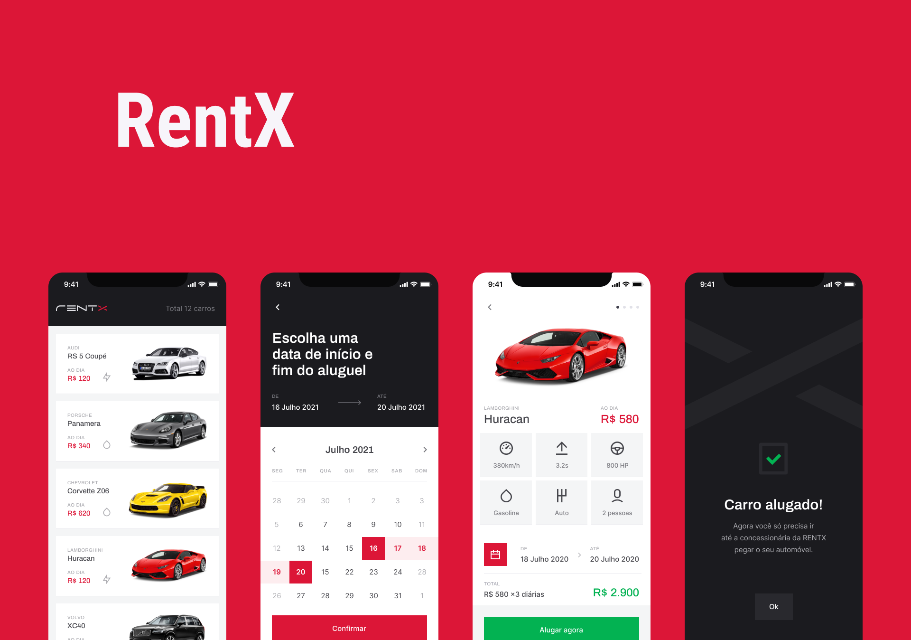

<h1 align="center">
  
</h1>

<p align="center">
  

 
</p>

<div display: flex align="center">
  
</div>

## 💻 Projeto

RentX é uma aplicação para efetuar agendamentos de carros, com uma interface intuitiva e possibilita também navegação em telas de forma offline.

## ✨ Tecnologias

- [x] Expo
- [x] Typescript
- [x] Axios
- [x] Styled Components
- [x] WatermelonDB
- [x] Fast Image

## 📄 Pré-requisitos

- [x] NodeJS >= 14.0
- [x] yarn
- [x] Expo >= 44.0.2
- [x] Expo-CLI

OBS: esta aplicação utiliza uma REST API para consultar listas de carros, cadastro de usuário, etc. Para que possa usar a aplicação de forma total para utilizar todos os recursos, é preciso baixar e executar <a href="https://github.com/brunodsazevedo/rentx-api">esse repositório</a>.

## Executando o projeto

Instale as dependências com o comando **yarn** em seu terminal e execute a aplicação em seu Android ou IOS com Expo:
```cl
expo run:android
```

```cl
expo run:ios
```
Ou execute utilizando yarn com react-native-cli
```cl
yarn run android
```
ou
```cl
yarn run ios
```

<br />

## 📄 Licença

Esse projeto está sob a licença MIT. Veja o arquivo [LICENSE](LICENSE.md) para mais detalhes.
